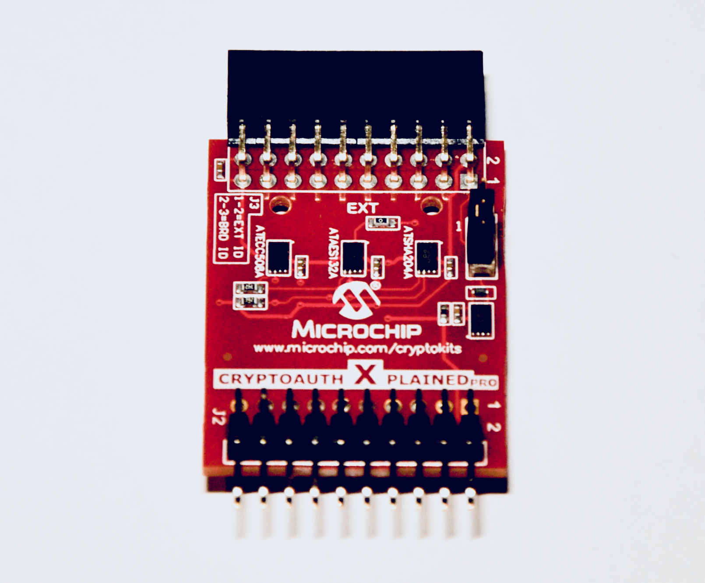
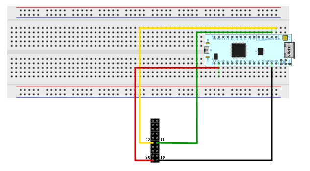

# MBED libs for CryptoAuth Xplained Pro


## Development environment setup
1) Install Atom editor

2) Install PlatformIO plugin

3) Cone this repo to your comp

## Board connections
Connect MBED according to depicted schema. (Arduino Nano v3)



## Usage demo
Just compile and upload into your board.
Open the terminal connection with 115200 baud rate.
```
*****************************
    CryptoAuth Pro tests.
press 0 or hit ENTER for menu
*****************************
 1 - Scan i2c bus
 2 - Read ATSHA204A device rev
 3 - Gen. random with ATSHA204A
 4 - Read data from ATSHA204A
 5 - Read config from ATSHA204A
> 1
 *** Scanning i2c bus. ***
 Address
 7b   8b   Description
==== ==== ===============
0x50 0xA0 Atmel ATAES132A
0x60 0xC0 Atmel ATECC508A
0x64 0xC8 Atmel ATSHA204A
-------------------------
Total devices found : 3
> 2
 *** Read ATSHA204A device revision ***
LEN(0x07;7)
 Wrd#  B0 B1 B2 B3
====== == == == ==
[0x00] 00 02 00 09
------------------
CRC(0x60 0x2B)
> 3
 *** Read ATSHA204A random number ***
LEN(0x23;35)
 Wrd#  B0 B1 B2 B3
====== == == == ==
[0x00] FF FF 00 00
[0x01] FF FF 00 00
[0x02] FF FF 00 00
[0x03] FF FF 00 00
[0x04] FF FF 00 00
[0x05] FF FF 00 00
[0x06] FF FF 00 00
[0x07] FF FF 00 00
------------------
CRC(0x41 0x1A)
> 4
 *** Read ATSHA204A data ***
Enter zone number : 0
Enter slot number : 0
Enter offset      : 0
32B read (y/N)    : true
LEN(0x23;35)
 Wrd#  B0 B1 B2 B3
====== == == == ==
[0x00] 01 23 E7 A5
[0x01] 00 09 04 00
[0x02] F5 1F 24 53
[0x03] EE 0D 01 00
[0x04] C8 00 55 00
[0x05] 8F 80 80 A1
[0x06] 82 E0 A3 60
[0x07] 94 40 A0 85
------------------
CRC(0xAE 0x32)
> 5
 *** Read ATSHA204A config ***
LEN(0x5B;91)
 Wrd#  B0 B1 B2 B3
====== == == == ==
[0x00] 01 23 E7 A5
[0x01] 00 09 04 00
[0x02] F5 1F 24 53
[0x03] EE 0D 01 00
[0x04] C8 00 55 00
[0x05] 8F 80 80 A1
[0x06] 82 E0 A3 60
[0x07] 94 40 A0 85
[0x08] 86 40 87 07
[0x09] 0F 00 89 F2
[0x0A] 8A 7A 0B 8B
[0x0B] 0C 4C DD 4D
[0x0C] C2 42 AF 8F
[0x0D] FF 00 FF 00
[0x0E] FF 00 FF 00
[0x0F] FF 00 FF 00
[0x10] FF 00 FF 00
[0x11] FF FF FF FF
[0x12] FF FF FF FF
[0x13] FF FF FF FF
[0x14] FF FF FF FF
[0x15] 00 00 55 55
------------------
CRC(0x5B 0x8E)
```

## References
### I2C
- [I2C-bus specification and user manual](https://www.nxp.com/docs/en/user-guide/UM10204.pdf) by NXP Semiconductors.
- [7-bit, 8-bit, and 10-bit I2C Slave Addressing](https://www.totalphase.com/support/articles/200349176-7-bit-8-bit-and-10-bit-I2C-Slave-Addressing#reserved) by Total Phase
- [MBEDOS I2C Driver Reference](https://os.mbed.com/docs/latest/reference/i2c.html) by ARM MBED
- [Using the I2C Bus](http://www.robot-electronics.co.uk/i2c-tutorial) by Robot Electronics
### ATSHA204A
- [Using the Atmel CryptoAuthentication ATSHA204A](https://www.insidegadgets.com/2017/04/21/alarm-system-v3-part-3-using-the-atmel-cryptoauthentication-atsha204a/) by insideGadgets
### CRC online calculators
- [CRC Calculator (Javascript)](http://www.sunshine2k.de/coding/javascript/crc/crc_js.html) by Bastian Molkenthin
```
To check ATMEL CRC-16 set folowing parameters:
- CRC width                                 = CRC-16
- CRC parametrization                       = Custom
- CRC detailed parameters, Input reflected  = ON
- CRC detailed parameters, Result reflected = OFF
- CRC detailed parameters, Polynomial       = 0x8005
- CRC detailed parameters,Initial Value     = 0x00
- CRC detailed parameters,Final Xor Value   = 0x00  
```

## Basic terminology
**nonce** - is an arbitrary number that can only be used once. It is often a pseudo-random number.

**crc polynomial** - a polynomial which becomes the divisor in a polynomial long division, which takes the message as the dividend and in which the quotient is discarded and the remainder becomes the result.

## Byte and Bit ordering
| Device    | Array of Bytes     | Byte ordering | Bit ordering (i2c) | Word ordering in Keys                       |
|:---------:|--------------------|---------------|--------------------|---------------------------------------------|
| ATSHA204A |byte index #0 first | LSB first     | MSb first          |                                             |
| ATECC508A |byte index #0 first | LSB first     | MSb first          | most significant word at the lowest address |
| ATAES132A |byte index #0 first | MSB first     | MSb first          |                                             |

## ATSHA204A

### ATSHA204A Jargon
*encrypted reads* - encrypted reads with the key (read key) in specific slot

*source key for the computation performed by the DeriveKey command* - n/a

*Roll-Key operation* - the source key that will be combined with TempKey is the target key specified in the command DeriveKey (SlotConfig[TargetKey].Bit12 must be 0)

*Create Key operation* - the source key is the parent key of the target key, which is found in SlotConfig[TargetKey].WriteKey (SlotConfig[TargetKey].Bit12 must be 1)

*parent key* - n/a

*hardware transport key array* - n/a


### ATSHA204A Slot Configs bytes
```
|Byte 0                         |Byte 1                           |
| b0  b1  b2  b3  b4  b5  b6  b7| b8  b9  b10 b11 b12 b13 b14 b15 |
  <---+--------> <+> <+> <+> <+>  <------+------> <------+------>
      |           |   |   |   |          |               +>> *WriteConfig* Write Configuration Bits
      |           |   |   |   |          +>> *WriteKey* Slot of the key to be used to validate encrypted writes.
      |           |   |   |   +>> *IsSecret* - 0=The slot is not secret and allows clear read, clear write,
      |           |   |   |                      no MAC check, and no Derivekey Command
      |           |   |   |                    1=The slot is secret. Reads and writes if allowed, must be encrypted.
      |           |   |   +>> *EncryptRead*
      |           |   +>> *SingleUse* - 0=No limit on the number of time the key can be used.
      |           |                     1=Limit on the number of time the key can be used based on the UseFlag
      |           |                       (or LastKeyUse)
      |           +>> *CheckOnly*
      +>> *ReadKey* - Slot of the key to be used for encrypted reads.


Command.   
```

## TODO:
calculate SHA256 - DONE!
- cmd 0x47 for ATECC508A
    * input: msg, msglen
    * output: sha256 + store it in TempKey

calculate HMAC
- cmd 0x47 for ATECC508A
    * input: msg, msglen, keyID
    * output: HMAC + store it in TempKey

sign with ECDSA
- cmd 0x41 for ATECC508A
    * input: keyID
    * output: signed digest from TempKey
